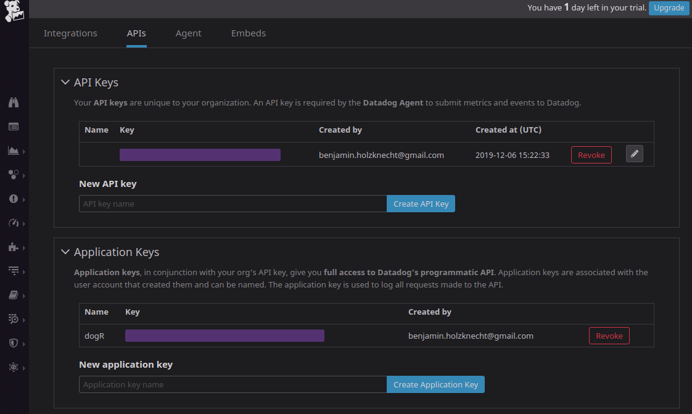

```{r setup, include = FALSE}
knitr::opts_chunk$set(
  collapse = TRUE,
  comment = "#>"
)

require("dogR")
```
DogR provides functionality for sending logs to Datadog and quering them from Datadog via the Datadog-API.

## Setup-Datadog
For interacting with the Datadog-API a APPlication- and API-Key is necessary. They can easily be created under
Integrations - APIs.

{width=100%}


## Steup-R
First, the package must be installed and sourced:

```{r, eval=FALSE}
install.packages("dogR")
library("dogR")
```
The next step includes setting the APPlication- and API-Key for the session:
```{r, eval=FALSE}
authentication()
```

In case you are using RStudio, a popup will show up, otherwise the keys can be entered via
the console. The keys are saved within a environment variable, therefore they are gone after the session.

Now the top level domains must be set. Depending which Datadog URL you are using this can be `.eu` or `.us`.

In my case I will set `.eu` as top level domain:
```{r, eval=FALSE}
set_api_top_level_domains(".eu")
#> Api url set to: https://http-intake.logs.datadoghq.eu/v1/input/
#> Api url set to: https://api.datadoghq.eu/api/v1/logs-queries/
```


If no domain is set, `.eu` will be used as default.

## Sending and Quering logs
For sending logs to Datadaog there are two functions, sending plain text via `send_plain_text()` and sending a
JSON object via `send_json()`, both are very simple to use:


```{r, eval=FALSE}
# send plain text
mbody <- "Hello DDog!"
send_plain_text(mbody)
#> Response []
#>   Date: 2020-01-18 16:35
#>   Status: 200
#>   Content-Type: application/json
#>   Size: 2 B
```


```{r, eval=FALSE, echo=TRUE}
# creating some mock data
 df <- data.frame(
   http_status = c(200, 400, 500),
   hostname = c("https://github.com/holzben",
                "https://github.com/holzben_not",
                "https://github.com/holzben_not"),
   env = c("prod", "prod", "prod"),
   message = c("POST 200 https://github.com/holzben_not",
               "POST 400 https://github.com/holzben_not",
               "POST 500 Good: https://github.com/holzben_not"))

 # convert data.frame to json and send it ...
 send_json(jsonlite::toJSON(df))
#> Response []
#>   Date: 2020-01-18 16:36
#>   Status: 200
#>   Content-Type: application/json
#>   Size: 2 B
```

Also for getting logs from Datadog two functions are available. `query_logs_httr()`
returns the the complete `httr` (see also [httr-package](https://cran.r-project.org/web/packages/httr/vignettes/quickstart.html))
response with all headers.

```{r, eval=FALSE}
# get httr response
response <- query_logs_httr("POST 200", time_from = "now -1d", limit = 1)
response
#> Response []
#>   Date: 2020-01-18 16:36
#>   Status: 200
#>   Content-Type: application/json;charset=utf-8
#>   Size: 498 B


# parse the result
jsonlite::fromJSON(httr::content(response, type = "text"), flatten = TRUE)
#> $logs
#>                                                   id
#> 1 AQAAAW-5fe1gk-rgPwAAAABBVy01ZmUxZ1NEc2toZTcwMzlQRQ
#>                 content.host                         content.message
#> 1 https://github.com/holzben POST 200 https://github.com/holzben_not
#>          content.timestamp                       content.tags
#> 1 2020-01-18T16:30:35.360Z source:undefined, source:undefined
#>   content.attributes.hostname content.attributes.http_status
#> 1  https://github.com/holzben                            200
#>   content.attributes.env
#> 1                   prod
#>
#> $nextLogId
#> [1] "AQAAAW-5fNVJzLI9KAAAAABBVy01Zk5WSm9PT25RLWxBTzEwVQ"
#>
#> $status
#> [1] "done"
#>
#> $requestId
#> [1] "Mjd3QXVNSmhRci01LUYyXy03dGFTZ3w4RDVtT2l4ZGM1eHVLRTJ0VS1qTlJR"
```
The second option `query_logs_df()` directly returns a `data.frame()`. If the status code was not ok, a warning will
occur and a empty `data.frame()` will be returned.

```{r, eval=FALSE}
# get all from last hour
query_logs_df("POST 200", time_from = "now -1d", limit = 1)
#>                                                   id
#> 1 AQAAAW-5fe1gk-rgPwAAAABBVy01ZmUxZ1NEc2toZTcwMzlQRQ
#>                 content.host                         content.message
#> 1 https://github.com/holzben POST 200 https://github.com/holzben_not
#>          content.timestamp                       content.tags
#> 1 2020-01-18T16:30:35.360Z source:undefined, source:undefined
#>   content.attributes.hostname content.attributes.http_status
#> 1  https://github.com/holzben                            200
#>   content.attributes.env
#> 1                   prod
```

Both functions using `query` argument which follows the Datadog search syntax
see [Datadog search syntax](https://docs.datadoghq.com/logs/explorer/search/#search-syntax) for more details.
In case " are necessary, the `quote()` function can be used.

```{r, eval=FALSE}
# use quote
q <- quote("https://github.com/holzben_not")
query_logs_df(q, time_from = "now -1d", limit = 1)
#>                                                   id
#> 1 AQAAAW-5fe1gk-rgQQAAAABBVy01ZmUxZ1NEc2toZTcwMzlQSQ
#>                     content.host
#> 1 https://github.com/holzben_not
#>                                 content.message        content.timestamp
#> 1 POST 500 Good: https://github.com/holzben_not 2020-01-18T16:30:35.360Z
#>                         content.tags    content.attributes.hostname
#> 1 source:undefined, source:undefined https://github.com/holzben_not
#>   content.attributes.http_status content.attributes.env
#> 1                            500                   prod
```

The time parameters `time_from` and `time_to` can be provided in as relative time eg. `now - 1h, now -2d`, as `ISO 8601` eg. `2020-01-18T13:00Z`
(see [ISO 8601](https://en.wikipedia.org/wiki/ISO_8601)) or unix timestamp.

```{r, eval=FALSE}
# as ISO 8601 date-time
query_logs_df("POST 200", time_from = "2020-01-18T13:00Z", limit = 1)
#>                                                   id
#> 1 AQAAAW-5fe1gk-rgPwAAAABBVy01ZmUxZ1NEc2toZTcwMzlQRQ
#>                 content.host                         content.message
#> 1 https://github.com/holzben POST 200 https://github.com/holzben_not
#>          content.timestamp                       content.tags
#> 1 2020-01-18T16:30:35.360Z source:undefined, source:undefined
#>   content.attributes.hostname content.attributes.http_status
#> 1  https://github.com/holzben                            200
#>   content.attributes.env
#> 1                   prod
```

With the limit parameter the number of logs return in the response is controlled, currently a maximum is 1000 is supported by the Datadog-Api.
